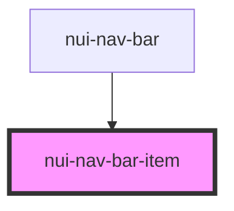

# nui-nav-bar-item

<!-- Auto Generated Below -->

## Properties

| Property | Attribute | Description                     | Type     | Default     |
| -------- | --------- | ------------------------------- | -------- | ----------- |
| `name`   | `name`    | Name of the nav bar item        | `string` | `undefined` |
| `to`     | `to`      | Link to the redirected location | `string` | `undefined` |

## Dependencies

### Used by

 - [nui-nav-bar](..)

### Graph

----------------------------------------------

*Built with [StencilJS](https://stenciljs.com/)*
