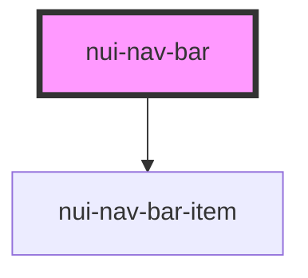

# NavBar Component `<nui-nav-bar>`

## Example

```
<nui-nav-bar logo_url="/assets/logo.img" logo_name="Logo">
    <nav-bar-item to="/">Item1</nav-bar-item>
    <nav-bar-item to="https://google.com">Item2</nav-bar-item>
</nui-nav-bar>
```

## Component Parameters

```
<nav-bar-item to="{REDIRECT_URL}">{TITLE_OF_ITEM}</nav-bar-item>
```

<!-- Auto Generated Below -->


## Properties

| Property    | Attribute   | Description                                                                   | Type     | Default     |
| ----------- | ----------- | ----------------------------------------------------------------------------- | -------- | ----------- |
| `logo_name` | `logo_name` | Name of the logo Used as a default placeholder if logo image is not available | `string` | `undefined` |
| `logo_url`  | `logo_url`  | URL of the logo image                                                         | `string` | `undefined` |


## Dependencies

### Depends on

- [nui-nav-bar-item](nav-bar-item)

### Graph


----------------------------------------------

*Built with [StencilJS](https://stenciljs.com/)*
